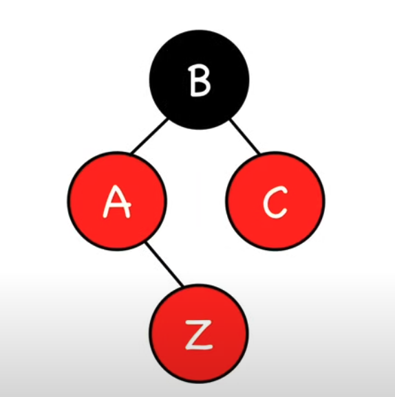
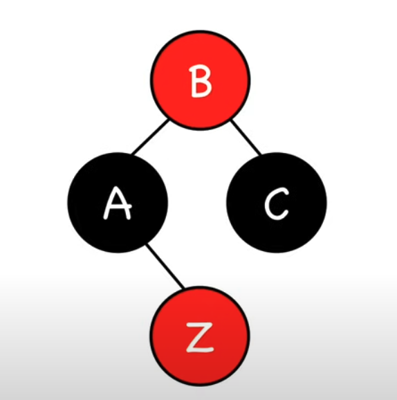
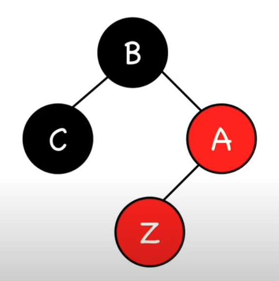
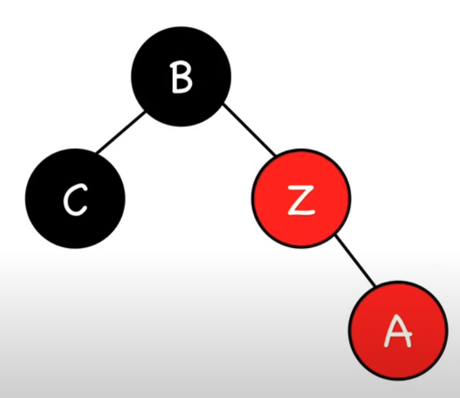
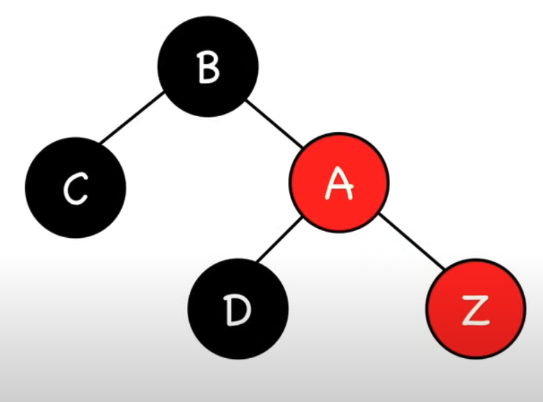
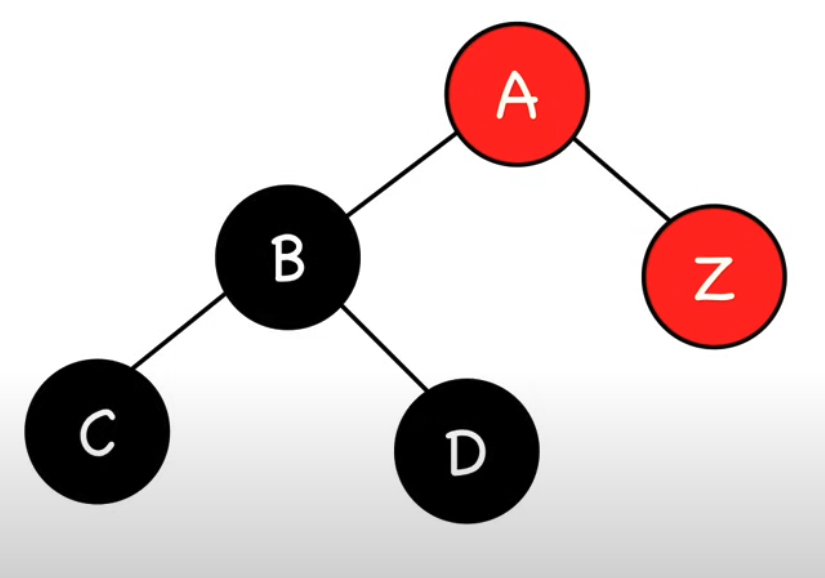

## Cel

Sporządzenie klasy obsługującej drzewa czerwono - czarne

## Czym są drzewa czerwono-czarne?

Drzewo czerwono-czarne to samobalansujące się drzewo poszukiwań
binarnych, które spełnia następujące warunki

1. Każdy węzeł mam przypisany kolor: czerwony lub czarny
2. Korzeń jest czarny
3. Liście są czarne
4. Czerwony węzeł nie może mieć czerwonego syna
5. Na każdej ścieżce od korzenia do liści jest tyle samo
   czarnych węzłów

Wymagania te gwarantują, że najdłuższa ścieżka od korzenia do liścia będzie co najwyżej dwukrotnie dłuższa, niż najkrótsza.

Podstawowe operacje na drzewach czerwono-czarnych obejmują:

-   search(value) - przeszukanie, czy drzewo zawiera daną wartość
-   insert(value) - wstawienie nowej wartości value do drzewa
-   remove(value) - usunięcie istniejącej wartości z drzewa

## Operacja search

## Operacja insert

Zaczynamy od wstawienia nowego node (Z) pokolorowanego na czerwono w sposób standardowy dla drzewa binarnego. Następnie naprawiamy postałe niezgodności poprzez ponowne kolorowanie nodów i rotacje.

Po wstawieniu elementu możliwe są 4 scenariusze wymagające naprawy:

1.  Nowy node zostanie korzeniem

$\rightarrow$ Zmiana koloru node na czarny

1. Brat rodzica nowego node jest czerwony

$\rightarrow$ Zmiana koloru rodzica, dziadka i wujka

2. Brat rodzica nowego node jest czarny (trójkąt)

$\rightarrow$ Rotacja rodzica. Przypadek kiedy rodzic jest prawym dzieckiem a node lewym, lub rodzic lewym a node prawym.

Następnie naprawiamy koloryzację.

3. Brat rodzica nowego node jest czarny (linia)

$\rightarrow$ Rotacja dziadka. Przypadek gdy zarówno rodzic, jak i dziecko są lewymi/ prawymi dziećmi.

$\rightarrow$ pokolorowanie node A na czarno, node B na czerwono.

W pozostałych przypadkach insercja nie spowoduje konieczności rebalansowania drzewa.

## Operacja remove

Operacja usuwania wartości z drzewa odbywać się będzie w 3 etapach.

1. Uruchoniemie funkcji transplant()
   Funkcja transplant pozwala na przesuwanie poddrzew w obrębie drzewa binarnego. Jest używana do zastąpienia usuwanego node jego dzieckiem.
2. Usunięcie właściwego node
3. Poprawinie kolorów drzewa z usuniętym elementem
