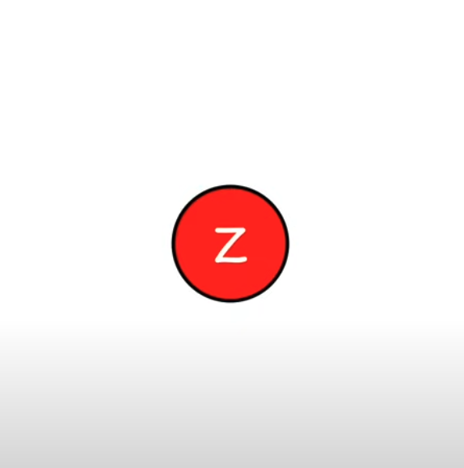

## Cel

Sporządzenie klasy obsługującej drzewa czerwono - czarne

## Czym są drzewa czerwono-czarne?

Drzewo czerwono-czarne to samobalansujące się drzewo poszukiwań
binarnych, które spełnia następujące warunki

1. Każdy węzeł mam przypisany kolor: czerwony lub czarny
2. Korzeń jest czarny
3. Liście są czarne
4. Czerwony węzeł nie może mieć czerwonego syna
5. Na każdej ścieżce od korzenia do liści jest tyle samo
   czarnych węzłów

Wymagania te gwarantują, że najdłuższa ścieżka od korzenia do liścia będzie co najwyżej dwukrotnie dłuższa, niż najkrótsza.

Podstawowe operacje na drzewach czerwono-czarnych obejmują:

-   search(value) - przeszukanie, czy drzewo zawiera daną wartość
-   insert(value) - wstawienie nowej wartości value do drzewa
-   remove(value) - usunięcie istniejącej wartości z drzewa

## Operacja search

Przeszukuje drzewo w celu odnalezienia węzła o konkretnej wartości. Zwraca wskaźnik na daną wartość lub nullptr.

## Operacja insert

Zaczynamy od wstawienia nowego node ($Z$) pokolorowanego na czerwono w sposób standardowy dla drzewa binarnego. Następnie naprawiamy postałe niezgodności poprzez ponowne kolorowanie nodów i rotacje.

Po wstawieniu elementu możliwe są 4 scenariusze wymagające naprawy:

1.  Nowy node zostanie korzeniem

$\rightarrow$ Zmiana koloru $Z$ na czarny

1. Brat czerwonego rodzica $Z$ jest czerwony

$\rightarrow$ Zmiana koloru rodzica, dziadka i wujka. Jeśli $B$ jest korzeniem, zmiana jego koloru na czarny.

2. Brat czerwonego rodzica $Z$ jest czarny (trójkąt)

$\rightarrow$ Rotacja rodzica. Przypadek kiedy rodzic jest prawym dzieckiem a node lewym, lub rodzic lewym a node prawym.

Następnie naprawiamy koloryzację.

3. Brat rodzica $Z$ jest czarny (linia)

$\rightarrow$ Rotacja dziadka. Przypadek gdy zarówno rodzic, jak i dziecko są lewymi/ prawymi dziećmi.

$\rightarrow$ pokolorowanie node $A$ na czarno, node B na czerwono.

W pozostałych przypadkach insercja nie spowoduje konieczności rebalansowania drzewa.

## Operacja remove

Operacja usuwania wartości z drzewa odbywać się będzie w 2 etapach.

1. Usunięcie właściwego node
2. Poprawinie kolorów drzewa z usuniętym elementem

Usunięcie właściwego node jest trudniejsze od wstawiania, ponieważ należy rozważyć więcej przypadków.

-   Przypadek 1

    

    Usuwany węzeł $X$ nie posiada lewego syna.
    Usuwamy z drzewa węzeł $X$, a na jego miejsce wstawiamy jego prawego
    syna $Y$. Jeśli usunięty węzeł był czarny, to operacja ta może
    naruszać warunek 4, jeśli $Y$ oraz jego nowy ojciec są węzłami
    czerwonymi. W takim przypadku przywracamy warunek zmieniając
    kolor węzła $Y$ na czarny.

-   Przypadek 2

    

    Przypdek symetryczny do 1, usuwany węzeł nie posiada prawego syna.
    Usuwamy węzeł $X$, zastępując go
    lewym synem. Jeśli $X$ był czarny, kolorujemy Y na czarno.
    Przypadki 1 i 2 obejmują również brak synów
    w węźle $X$. W takim przypadku $X$ zostaje zastąpiony przez węzeł
    strażnika/ nullptr, który jest czarny.

-   Przypadek 3

    

    Węzeł $X$ posiada dwóch synów, z których prawy $Z$ jest następnikiem.
    Węzeł $X$ zastępujemy następnikiem $Z$. Lewym synem $Z$ staje się
    węzeł $Y$. Następnik zawsze ma lewego syna pustego (w przeciwnym
    razie nie byłby najmniejszym elementem w prawej gałęzi drzewa).
    Następnik otrzymuje kolor węzła $X$. Jeśli następnik był czarny, to
    jego prawy syn $ZR$ otrzymuje umownie dodatkowy kolor czarny
    – jeśli $ZR$ był czarny, to jest teraz podwójnie czarny, a jeśli był
    czerwony, to jest czerwono-czarny. Zostanie to rozwiązane w dalszej
    części algorytmu.

-   Przypadek 4.

    

    Węzeł $X$ posiada dwóch synów, jednak następnik nie jest jego
    prawym synem. Następnik $A$ zostaje zastąpiony w drzewie swoim
    prawym synem $B$ (kolor $A$ zachowujemy dla $B$). Do węzła $X$ kopiujemy
    zawartość następnika $A$ bez pola koloru (kolor $X$ zostaje zachowany
    dla $A$). Jeśli następnik $A$ był czarny, to jego prawy syn $B$ otrzymuje
    umownie dodatkowy kolor czarny – jeśli $B$ był czarny, to jest teraz
    podwójnie czarny, a jeśli był czerwony, to jest czerwono-czarny.
    Zostanie to rozwiązane w dalszej części algorytmu.

Przypadki 3 i 4 wymagają korekty drzewa, jeśli następnik był czarny (w przeciwnym razie drzewo wciąż jest drzewem czerwono-czarnym i operację usuwania węzła możemy zakończyć). W takim przypadku prawy syn następnika posiada dodatkowy kolor czarny. Ponieważ ze ścieżek, które wcześniej zawierały usunięty węzeł, zniknął jeden węzeł czarny, to musimy ten kolor dodać do węzła znajdującego się na tych ścieżkach, czyli do prawego syna następnika. Powstaje ciąg czterech symetrycznych przypadków, które są lustrzanymi odbiciami. Węzeł posiadający dodatkowy kolor czarny będziemy umownie oznaczali gwiazdką. Kolor szary oznacza, że węzeł może być czerwony lub czarny.

-   Przypadek 1

    

    Brat węzła $A^*$ (węzeł $C$ ) jest czerwony.
    Wykonujemy rotację w lewo względem $B$
    (ojciec węzła $A^*$). Zamieniamy kolory ojca
    (węzeł $B$) i dziadka (węzeł $C$). W ten sposób
    brat $A^*$ (teraz węzeł $D$) staje się węzłem
    czarnym. Otrzymujemy jeden z przypadków
    2, 3 lub 4, które rozróżniamy po kolorach
    synów brata $A^*$.

-   Przypadek 2

    

    Brat węzła $A^*$ (węzeł $C$) jest czarny i posiada czarnych synów (węzły $D$ i $E$). Zabieramy
    jeden kolor czarny z węzłów $A$ i $C$, przenosząc
    go w górę do węzła $B$. W efekcie węzeł $A$ nie
    ma już nadmiarowego koloru czarnego, staje
    się normalnym węzłem czerwonym lub czarnym.
    Z kolei zabranie koloru czarnego z węzła $C$
    skutkuje zmianą koloru na czerwony. Ponieważ
    obaj synowie $D$ i $E$ są czarni, zmiana ta nie
    powoduje naruszenia warunku drzewa
    czerwono-czarnego. Ponieważ problem
    dodatkowego koloru czarnego przeniósł się
    w górę drzewa do węzła $B$ (ojca $A$), to wracamy
    do rozpatrywania przypadków z węzłem B\*.

-   Przypadek 3

    

    Brat węzła $A^*$ (węzeł $C$) jest czarny, lewy syn
    węzła $C$ jest czerwony, prawy syn węzła $C$ jest
    czarny. Wykonujemy rotację w prawo względem
    węzła $C$, po czym zamieniamy kolory pomiędzy
    węzłami $C$ i $D$. Otrzymujemy w ten sposób
    przypadek 4.

-   Przypadek 4

    

    Brat węzła $A^*$ (węzeł $C$) jest czarny, a jego prawy
    syn jest czerwony. Wykonujemy rotację
    względem węzła $B$ (ojciec $A^*$). Przenosimy kolor
    z węzła $B$ do $C$. W takim przypadku $B$ traci kolor
    i możemy w tym węźle umieścić dodatkowy kolor
    czarny z węzła $A$. Dzięki temu pozbywamy się
    dodatkowej czerni. Na koniec węzeł $E$ kolorujemy
    na czarno. Ta transformacja przywraca strukturę
    drzewa czerwono-czarnego, zatem kończy
    operację usuwania węzła.

## Podsumowanie

Drzewa czerwono-czarne to efektywna struktura danych, zapewniająca samobalansowanie i gwarantująca optymalne czasy działania operacji wyszukiwania, wstawiania i usuwania. Dzięki zachowaniu kluczowych właściwości kolorystycznych oraz rotacjom umożliwiają utrzymanie wysokości drzewa na poziomie logarytmicznym względem liczby węzłów. Ich szerokie zastosowanie obejmuje systemy plików, bazy danych oraz inne systemy wymagające szybkiego dostępu do danych i częstych modyfikacji.
